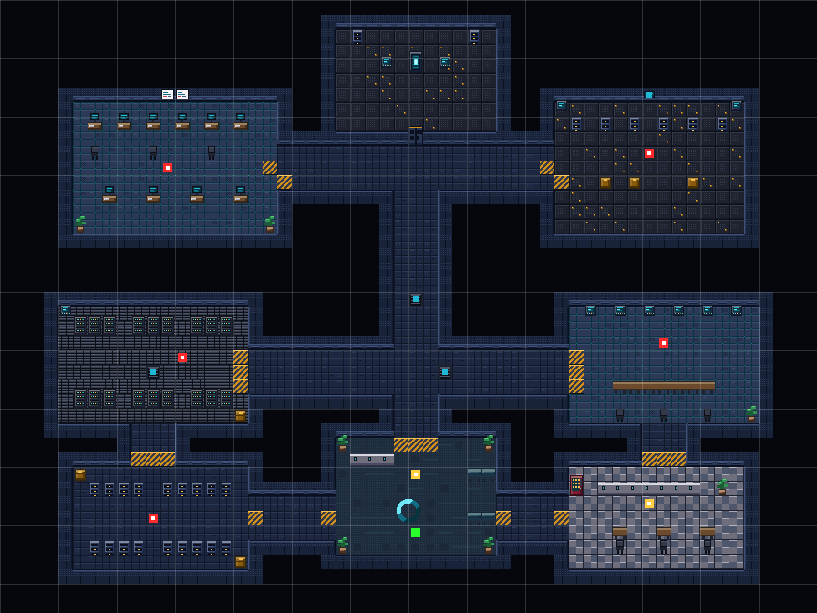
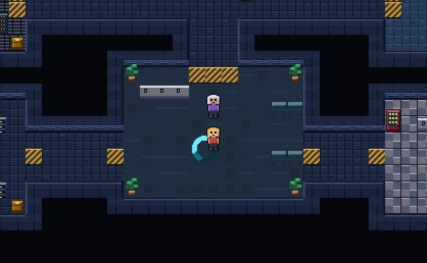
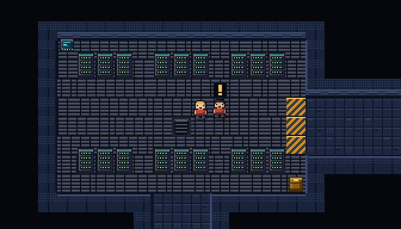
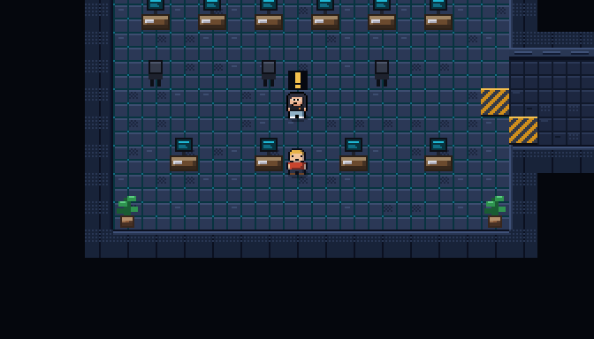

# SECCIÓN 7 — Agencia de Datos

Videojuego pixel art de vista cenital para una competencia de programación por
equipos. Un escuadrón, un personaje, un edificio con salas conectadas por
pasillos, y en cada departamento un especialista con un problema de datos que
se resuelve **escribiendo Python de verdad dentro del juego**.



| Recepción | Sala de servidores | Laboratorio de datos |
|---|---|---|
|  |  |  |

---

## Cómo se abre

**Doble clic en `jugar.bat`** (Windows) o `./jugar.sh` (Mac y Linux). Levanta un
servidor local y abre el navegador solo.

> **Por qué no basta con abrir `index.html`.** El intérprete de Python del
> navegador carga sus archivos con `fetch()`, y desde `file://` el navegador
> bloquea esas peticiones por seguridad. Con doble clic en `index.html` el
> edificio se ve y se camina, pero la terminal de Python no arranca y el juego
> lo dice en pantalla. El lanzador resuelve eso con un comando.

Si prefieres a mano:

```
cd codex-quest
python jugar.py
```

### Sin internet

La primera vez, el intérprete se baja de un CDN (unos 13 MB, y el navegador lo
guarda en caché). Para una sede con internet dudoso, déjalo guardado en el
proyecto:

```
python herramientas/descargar_python.py
```

Descarga **13,1 MB** a `vendor/pyodide/`. El juego detecta esa carpeta solo y
deja de pedir internet. Después basta copiar la carpeta completa a cada
computadora. Para volver al CDN, borra `vendor/`.

## Cómo se juega

| Acción | Teclas |
|---|---|
| Mover | `W A S D` o flechas |
| Hablar / aceptar encargo / leer terminal | `E`, `Espacio` o `Enter` (o clic) |
| Ver los encargos pendientes | `TAB` o el botón `☰` del HUD |
| Pantalla completa | `F` o el botón `⛶` del HUD |
| Ejecutar el código | `Ctrl+Enter` o el botón EJECUTAR |
| Cerrar | `Esc` |

Los personajes con un encargo pendiente muestran un **`!`** ámbar sobre la
cabeza; los ya resueltos, un **`✓`** verde. El progreso se guarda solo en el
navegador, y **el código escrito se conserva** aunque se cierre la pestaña: el
botón CONTINUAR devuelve la partida con los borradores intactos.

## Varios equipos a la vez

El juego puede registrar en la nube lo que hace cada equipo, para que veas el
avance de todos desde un panel. Se monta una vez, en unos cinco minutos:
**`herramientas/COMPETENCIA.md`**.

Lo importante en dos líneas:

- **Se guarda el código, no solo el puntaje.** Un navegador puede reportar el
  número que quiera; el código enviado, en cambio, se revisa. Y deja ver dónde
  se atascó cada equipo.
- **Los equipos escriben pero no leen.** La clave que viaja en la página solo
  puede insertar. Si pudiera leer, un equipo consultaría la base y vería el
  código de sus compañeros.
- **El panel entra con usuario y contraseña**, y solo leen los correos que
  estén en una lista blanca. No hay ninguna clave de administrador en el
  navegador de nadie.
- **Sin nube el juego funciona igual.** Si no hay configuración, o si se cae la
  red, cada equipo guarda su progreso en su navegador y los envíos pendientes
  esperan en cola. La partida nunca se detiene por un problema de red.

## La lista de encargos

Lo que dice la directora al empezar no alcanza: son siete salas y cinco
encargos, y a los diez minutos ya nadie recuerda quién pedía qué. Con `TAB` se
abre la lista en cualquier momento:

- qué pide cada departamento y **en qué sala está**,
- cuánto vale,
- qué ya está resuelto (tachado y en verde),
- y el reto final, con candado hasta reunir las cinco credenciales.

## Experiencia y rangos

Además del puntaje —que es el marcador de la competencia— hay una barra de
experiencia con rangos, de *Recluta* a *Jefe de Seccion*.

La experiencia sube al resolver encargos, pero **también por explorar**: 15 XP
la primera vez que hablan con alguien y 10 XP por cada terminal que leen. Está
hecho a propósito: resolver los seis retos da 1050 XP y el último rango pide
1150, así que para llegar hay que haber recorrido el edificio y hablado con la
gente, no solo acertar.

A diferencia del puntaje, la experiencia **no baja al pedir una pista**: lo
aprendido no se descuenta.

La tabla de rangos y cuánto da explorar están en `js/retos.js`, en `niveles` y
`xpExplorar`. Se pueden tocar sin miedo; hay una prueba que avisa si el rango
máximo queda inalcanzable.

## La historia

A las 03:14 el Índice Central de la Agencia se corrompió. Cada departamento
guarda una credencial y ninguno la entrega gratis: primero hay que resolverle
el problema que tiene atascado. Con las cinco credenciales se abre la compuerta
del Núcleo, donde espera el reto final.

## El edificio

```
                       ┌─────────┐
                       │  NÚCLEO │   ← se abre con 5 credenciales
                       └────┬────┘
   ┌──────────────┐         │         ┌──────────────┐
   │ LABORATORIO  ├─────────┼─────────┤    BÓVEDA    │
   └──────────────┘         │         └──────────────┘
   ┌──────────────┐         │         ┌──────────────┐
   │  SERVIDORES  ├─────────┼─────────┤     REDES    │
   └──────┬───────┘         │         └───────┬──────┘
   ┌──────┴───────┐   ┌─────┴─────┐   ┌───────┴──────┐
   │   ARCHIVO    ├───┤ RECEPCIÓN ├───┤  CAFETERÍA   │
   └──────────────┘   └───────────┘   └──────────────┘
```

Ocho salas unidas en anillo, cada una con su piso, su mobiliario y su gente.
Se empieza en Recepción.

## Los retos de esta versión

| Sala | Personaje | Reto | Función | Puntos |
|---|---|---|---|---|
| Servidores | Bruno Oro | Registros duplicados | `contar_unicos` | 100 |
| Laboratorio | Annabella | Señal en el ruido | `promedio_valido` | 150 |
| Bóveda | Criptógrafa Noa | Descifrar el mensaje | `descifrar` | 150 |
| Redes | Ingeniera Rut | Saltos mínimos | `saltos_minimos` | 200 |
| Archivo | Archivista Díaz | El expediente sin pareja | `sin_pareja` | 150 |
| Núcleo | EL ÍNDICE | Reconstruir el Índice | `indice` | 300 |

Cada reto tiene casos visibles y **casos ocultos**: hay que pasar todos. Pedir
la pista cuesta 25 puntos y solo se cobra una vez.

---

## La terminal de Python

Cómo escribir retos nuevos, con la calibración de dificultad y las trampas
que ya nos mordieron: **`herramientas/prompt-retos.md`**.

Cada encargo abre un editor con numeración de líneas, `Tab` de 4 espacios,
sangría automática después de los dos puntos, **revisión de sintaxis mientras
se escribe** (con número de línea) y ejecución contra los casos de prueba.
Debajo aparece qué caso pasó, cuál falló y qué devolvió el código en su lugar.
Lo que se imprima con `print()` se muestra en un panel aparte.

El intérprete es **Pyodide**: CPython compilado a WebAssembly, corriendo dentro
del navegador. Se puede usar toda la librería estándar (`math`, `collections`,
`itertools`, `re`...). No hay que instalar Python en las computadoras de los
equipos: el que hace falta es solo para el lanzador.

### pandas

El intérprete trae **pandas** además de la librería estándar. Se carga en dos
tiempos: primero el intérprete básico (13 MB) para que se pueda empezar a
jugar de inmediato, y pandas (35 MB más) sigue bajando en segundo plano. La
pantalla del encargo avisa en qué va, y si un encargo necesita pandas no deja
ejecutar hasta que esté listo, con el motivo escrito.

Un reto puede pedir que su tabla llegue ya como DataFrame:

```js
funcion: "resumen",
comoDataFrame: true,   // los argumentos que sean lista de diccionarios
                       // llegan convertidos en DataFrame
```

**El corrector es tolerante con la forma de la respuesta**: un DataFrame se
compara igual que la lista de diccionarios equivalente (el orden de las
columnas no importa, el de las filas sí), una Series igual que una lista o un
diccionario según su índice, y los números de numpy igual que los de Python.
Por eso `groupby(...).sum()` se puede devolver tal cual, sin `reset_index()`.

Las tablas de los casos se escriben en forma compacta, para que quepan sin
volverse ilegibles:

```js
{ columnas: ["area", "maquina", "errores"],
  filas: [["redes", "M1", 3],
          ["datos", "M2", 0]] }
```

En la pantalla del reto se muestran resumidas
(`<tabla de 12 filas: area, errores, maquina>`).

Si vas a dar la competencia sin internet, acuérdate de que ahora son 49 MB:

```
python herramientas/descargar_python.py
```

### Cómo se evita que un bucle infinito arruine la partida

Tres redes, en este orden:

1. **`js/piloto.py` instala un vigilante por línea** (`sys.settrace`) que corta
   la ejecución a los 2 segundos. Es la que actúa casi siempre, y no obliga a
   recargar nada: el equipo ve *"tardó demasiado — ¿bucle infinito?"* y sigue
   trabajando con su código intacto.
2. Si alguien desactiva ese vigilante, **el Worker se mata a los 10 segundos**
   y se levanta uno nuevo.
3. Todo esto pasa en **otro hilo**, así que el juego nunca se congela.

---

## Para los organizadores: cambiar los retos

Todo el contenido está en **`js/retos.js`**. El motor no hay que tocarlo.

### Un reto de código

```js
reto: {
  titulo: "Registros duplicados",
  puntos: 100,
  enunciado: "...lo que se le pide al equipo...",
  funcion: "contar_unicos",          // nombre exacto que deben definir
  plantilla:                         // con esto arranca el editor
    "def contar_unicos(registros):\n" +
    "    # tu código\n" +
    "    pass\n",
  casos: [                           // se muestran en pantalla
    { entrada: [["A1", "B2", "A1"]], salida: 2 }
  ],
  casosOcultos: [                    // solo se anuncia cuántos son
    { entrada: [["x"]], salida: 1 }
  ],
  pista: "..."
}
```

`entrada` es la **lista de argumentos**: `entrada: [a, b]` llama a
`funcion(a, b)`.

**Los valores se escriben en JavaScript y se traducen solos a Python:**

| En `retos.js` | Llega a Python como |
|---|---|
| `null` | `None` |
| `true` / `false` | `True` / `False` |
| `[1, 2]` | `[1, 2]` (lista) |
| `{ area: "x" }` | `{"area": "x"}` (diccionario) |

La comparación con `salida` es en profundidad, una tupla vale igual que una
lista, y los números admiten un margen mínimo para no penalizar decimales.

> **Cuidado con los redondeos a la mitad exacta.** Python redondea
> `round(4.5)` a **4**, no a 5. Evita casos de prueba que dependan de eso, o
> di explícitamente en el enunciado qué regla usar.

### Un reto de respuesta escrita

Si prefieres que escriban una respuesta en vez de código, cambia `funcion` y
`casos` por:

```js
respuestaHash: "be6cf271"     // genérala en herramientas/hash.html
```

o directamente `respuesta: "codigo secreto"`. Se compara sin mayúsculas, sin
tildes y sin signos.

### Un personaje

```js
{
  id: "oro",
  nombre: "Bruno Oro",
  sala: "servidores",
  x: 12, y: 24, dir: "down",
  pelo: "#3a2a1e", ropa: "#c0432f", piel: "#e0b088",
  dialogos: {
    intro:     [ "lo que dice la primera vez (la bienvenida)" ],
    pendiente: [ "lo que dice si vuelven sin resolverlo" ],
    resuelto:  [ "lo que dice cuando ya lo lograron" ]
  },
  reto: { ... }
}
```

Para ubicar las coordenadas `x` / `y`, genera el plano con
`node pruebas/capturas.js` y mira `pruebas/capturas/planta.png`: trae rejilla
cada 4 casillas y los personajes marcados. Si pones a alguien encima de un
mueble, el motor quita el mueble para que no quede atrapado.

### Retratos en la caja de diálogo

Al hablar con alguien se ve su cara junto al texto. Hay dos formas de tenerla:

- **Archivo propio**: `retrato: "sprites/annabella-cara.png"`. Cualquier imagen
  cuadrada sirve; 48×48 es la escala del juego.
- **Dibujado por el motor**: si el personaje no trae `retrato`, se le dibuja un
  busto de 48×48 con su propia paleta. **Un guardián nuevo tiene cara sin que
  nadie dibuje nada.**

El busto dibujado acepta tres rasgos opcionales:

```js
lentes: true,      // anteojos
pelolargo: true,   // el pelo cae hasta los hombros
robot: true        // visor en lugar de ojos
```

Annabella es el ejemplo completo: usa `sprites/annabella.png` para el mundo y
`sprites/annabella-cara.png` para el diálogo. En el mundo mide 16×24 como todos
—a esa escala manda la silueta— y el detalle vive en el retrato de 48×48.
Sus fuentes editables están en `sprites/fuente/`.

### Sprites propios

Pon los PNG en `sprites/` y agrégalos con `sprite: "sprites/oro.png"`. El
formato, la plantilla para calcar y los consejos de estilo están en
**`sprites/LEEME.md`**. Si un PNG falta o falla al cargar, el motor vuelve solo
al dibujo por código sin romper nada.

---

## Verificar antes de la competencia

```
node pruebas/verificar.js
```

Unas cien comprobaciones, sin abrir el navegador. Necesita Node y Python.
**El código de los retos se ejecuta con el Python de la máquina usando el mismo
`js/piloto.py` que corre dentro del juego**, así que lo que se verifica aquí es
lo que va a pasar en la competencia. Vale la pena correrlo cada vez que se
edita `js/retos.js`. Revisa:

- **El edificio**: que se pueda llegar caminando a cada sala, a cada personaje
  y a cada terminal, que nadie haya quedado encerrado detrás de un mueble al
  mover una coordenada, y que el Núcleo empiece cerrado y se abra al final.
- **El intérprete**: que acepte lo correcto, rechace lo incorrecto, avise con
  número de línea cuando el código no compila, informe la excepción de un caso
  sin tumbar los demás, capture `print`, compare listas y diccionarios en
  profundidad, permita `import` de la librería estándar, y **corte de verdad un
  bucle infinito** (la prueba escribe un `while True:` y mide cuánto tarda).
- **Los retos**: corre una solución de referencia en Python de cada uno contra
  todos los casos (visibles y ocultos), y verifica que la plantilla compile
  pero **no** resuelva el reto sola.
- **Una partida entera**: hablar, fallar, pedir pista, acertar, juntar las
  cinco credenciales, abrir la compuerta, resolver el Índice y ver el informe.

Si cambias un reto, actualiza también la tabla `SOLUCIONES` que está arriba de
ese archivo: es la red que avisa cuando un caso de prueba quedó mal escrito.

```
node pruebas/capturas.js      # plano del edificio + vistas del juego
node pruebas/plantilla.js     # plantilla para dibujar personajes
```

Estas herramientas dibujan el juego con un canvas de software escrito en
`pruebas/canvas.js`: **el juego no depende de nada de la carpeta `pruebas/`**,
se puede borrar y sigue funcionando.

---

## Estructura

```
codex-quest/
├── jugar.bat / jugar.sh  lanzador (doble clic)
├── jugar.py              servidor local + abre el navegador
├── index.html            interfaz: HUD, diálogos, editor, pantallas
├── js/
│   ├── retos.js          ← historia, personajes y retos (editar aquí)
│   ├── config.js         URL y clave de la base de resultados
│   ├── registro.js       manda los intentos a la nube, con cola si falla
│   ├── piloto.py         corrector: corre el código del equipo en Python
│   ├── arte.js           paleta y dibujo de personajes y casillas
│   ├── mapa.js           planta del edificio: salas, pasillos, mobiliario
│   ├── codigo.js         puente con Pyodide y editor de código
│   └── juego.js          motor: cámara, física, diálogos, retos
├── sprites/              PNG de los personajes (ver LEEME.md)
├── vendor/pyodide/       intérprete guardado, opcional (13 MB, sin internet)
├── herramientas/
│   ├── COMPETENCIA.md        cómo montar la competencia (empieza aquí)
│   ├── supabase.sql          crea la base de datos de resultados
│   ├── panel.html            panel de organizadores (NO se publica)
│   ├── prompt-retos.md       cómo escribir retos nuevos
│   ├── descargar_python.py   deja el intérprete guardado
│   └── hash.html             genera respuestaHash para retos escritos
├── pruebas/              opcional, con Node + Python
│   ├── verificar.js      revisa edificio, intérprete, retos y una partida
│   ├── puente.py         corre piloto.py con el Python de la máquina
│   ├── capturas.js       dibuja el plano y vistas del juego
│   ├── plantilla.js      genera la plantilla de sprites
│   ├── entorno.js        carga el juego sin navegador
│   └── canvas.js         canvas 2D y codificador PNG en Node puro
└── README.md
```

Todo el arte se **dibuja por código**: no hay imágenes que se pierdan al copiar
la carpeta, y el edificio sale idéntico en todas las máquinas.

## Por qué el juego llena la pantalla sin estirarse

El lienzo nunca se estira. Estirarlo obligaría a una escala fraccionaria y en
pixel art eso significa que unos píxeles salen más anchos que otros.

Lo que hace el juego es al revés: elige la mayor **escala entera** que quepa en
la ventana y después agranda el área visible hasta llenarla. O sea que en una
pantalla grande no se ven píxeles más gordos: **se ve más edificio**. En una
ventana de 1462x856 se aprovecha el 98%, con cada píxel del mismo tamaño.

Hay un mínimo garantizado de 21x12 casillas, así que nadie ve menos de lo
previsto por tener una pantalla chica.

## Reglas del pixel art

Si tocas `js/arte.js`, estas cuatro sostienen el estilo:

1. **Luz desde arriba a la izquierda.** Brillos arriba e izquierda, sombras
   abajo y a la derecha. Sombrear todo el contorno por igual deja los objetos
   inflados y planos.
2. **Las sombras se van al azul, los brillos al cálido.** Una sombra no es el
   mismo color más oscuro; también es más fría.
3. **Tramado ordenado, nunca ruido al azar.** Damero o cuartos. El ruido
   aleatorio se ve sucio a esta escala.
4. **Nada de trazados vectoriales.** `arc()` y las diagonales con `lineTo()`
   salen suavizadas y dejan un halo. Los círculos y las diagonales se dibujan
   píxel a píxel.

Los muros no se dibujan a mano: se generan solos alrededor del piso y cada uno
elige su cara según a qué lado tiene sala (autotile de 4 bits). Para agregar una
sala basta con sumar un rectángulo a `SALAS` en `js/mapa.js`.

## Ideas para más adelante

- Un ranking compartido entre equipos (necesita un servidor de verdad).
- Retos por tiempo o con límite de intentos.
- Que los monitores del Laboratorio muestren los datos del reto en curso.
- Música de fondo (el sistema de sonido ya está, en `sfx`).
